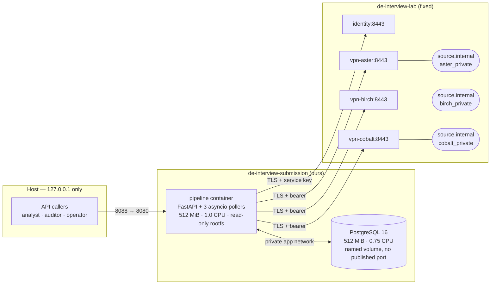

# Architecture

One small server, two containers, three independent ingestion loops, one
queryable operational view.

---

## System



The three private source networks are unreachable from us by construction: only
the matching gateway is attached to both a private network and `de-interview-transit`.
`source.internal` does not resolve from transit, which the lab probe verifies.

## Deployment units

| Unit | Contents | Why this boundary |
|---|---|---|
| `pipeline` | Result API, three source pollers, identity client | The pollers are I/O bound and idle most of the time. A second container would add a second connection pool, a second image to build and a second thing to restart, for isolation we cannot measure a need for at this scale. `ROLE=api\|worker\|all` keeps the split one config change away. |
| `postgres` | All persistent state | Correctness here is "apply a page and move the cursor atomically". That is a transaction, so the store has to be transactional. |

## Data flow

```
GET /v1/changes?cursor=N&limit=200
        │
        ▼
  normalize()  ── per-vendor adapter ──►  CanonicalEvent │ Rejection
        │                                      │              │
        ▼                                      ▼              ▼
  ┌─────────────────── ONE TRANSACTION ───────────────────────────┐
  │ event_seen    (source, event_id)      idempotency ledger      │
  │ case_event    append-only             lineage, payload hash   │
  │ case_current  version-wins upsert     business truth          │
  │ quarantine    (source, event_id)      rejects, reason codes   │
  │ source_state  cursor := next_cursor   watermark               │
  └───────────────────────────────────────────────────────────────┘
        │
        ▼
  GET /reports/daily   plain GROUP BY over case_current
  GET /cases           single row by (source, case_id)
```

**The cursor moves only inside the transaction that applies the page.** If
anything fails, the cursor stays where it was and the page is re-fetched.
Advancing it outside is the classic silent data-loss bug, and it is the first
thing worth checking in any change to `app/ingest/apply.py`.

## Storage model

| Table | Grain | Purpose |
|---|---|---|
| `source_state` | one row per source | cursor, health state, last success, failure counters |
| `event_seen` | `(source, event_id)` | idempotency ledger; makes redelivery a no-op |
| `case_current` | `(source, case_id)` | current business truth, one row per case at its latest version |
| `case_event` | `(source, event_id, seq)` | append-only lineage: payload **hash**, never the payload |
| `quarantine` | `(source, event_id)` | rejects with reason codes; the PK *is* the contract's "distinct rejected pairs" |
| `access_audit` | one row per business request | evidence that access control ran, allow and deny |

Business identity is `(source, case_id)`. Vendor case IDs collide across all
three sources by design — `C00001` exists in aster, birch and cobalt as three
different cases — so `case_id` alone is never a key.

## Update semantics

1. **Version wins.** An event applies only when `version > stored version`.
   Equal or lower is ignored. This single predicate makes duplicate delivery,
   out-of-order pages within a batch, and a full replay from cursor 0 all safe.
2. **Tombstones preserve attributes.** `op=delete` carries identity and version
   only. It sets `is_deleted` and bumps the version without nulling the known
   fields, so lineage survives a delete. Reports exclude it; `/cases` returns 404.
3. **Schema version is read, not guessed.** Birch v2 moved money from `amount`
   to `net_amount` and removed the old key. The adapter selects the field by
   declared `schema_version`; an unknown version is quarantined rather than
   falling back to whichever key happens to be present.
4. **Money is `Decimal`.** Birch sends major-unit decimal strings. A conversion
   that is not exactly representable in minor units is a validation failure, not
   a rounding.

## Reporting

No materialised aggregate. `/reports/daily` is a `GROUP BY` over 8,850 rows
behind a partial index on `(unit_id, status) WHERE NOT is_deleted`.

Measured p95 is 203 ms at eight concurrent clients against a 500 ms target, so
materialising would buy latency we do not need in exchange for refresh
scheduling, staleness windows and invalidation bugs. The threshold to revisit is
roughly two orders of magnitude more data, or a report that needs to span
history rather than current state. That is a measurement, not a preference —
see [RESOURCE_REPORT.md](RESOURCE_REPORT.md).

## Ingestion behaviour

Each source runs its own task with its own client, token bucket and backoff.
Nothing is awaited across sources, so a link down for thirty seconds costs
exactly one source its freshness.

| Response | Action | State after 3 in a row |
|---|---|---|
| `200` | apply page, advance cursor, reset failures | `healthy` |
| `429` | honour `Retry-After`, retry same cursor | unchanged |
| `503` transient / `link_unavailable` | honour `Retry-After` plus jitter, retry same cursor | `degraded` |
| `401` | back off 30 s, reload credentials from the mounted file | `degraded` |
| `400` | log loudly, back off 30 s — retrying an unchanged bad request cannot help | `degraded` |
| timeout / TLS / reset | exponential backoff with full jitter, cap 30 s | `degraded` |

Client rate budgets sit below the published ceilings — aster 6/s against 8,
birch 3/s against 4, cobalt 1.5/s against 2 — because the ceiling is enforced
source-wide across all connections, so crowding it only buys a 429 and a full
second of `Retry-After`.

Polling continues after `has_more=false`: the contract says new events become
visible later, so "caught up" is never "finished".

## Trust boundaries

Detailed in [TRUST_BOUNDARIES.md](TRUST_BOUNDARIES.md). In brief:

- **Host → API.** Loopback only. Every route but `/health` requires a bearer
  token verified by introspection.
- **API → identity.** Service key over TLS. Claims come from the fixture; a
  caller-supplied `X-Role` or `X-Units` is ignored.
- **Worker → gateways.** Per-source bearer over TLS, verified against the lab CA
  by issuer and hostname. Private source networks are unreachable.
- **App → database.** Private network, no published port, random generated password.

## Adding a fourth source

Three changes, no new machinery:

1. A credentials entry (URL and token) in the mounted `source_credentials.json`.
2. A config row: rate budget in `RATE_BUDGET`, unit codes in `KNOWN_UNITS`.
3. An adapter in `app/ingest/normalize.py` implementing
   `payload -> canonical fields`, plus its status vocabulary.

Cursor handling, retry, idempotency, storage, authorisation and reporting are
source-agnostic and untouched.

**Where we deliberately stop generalising.** There is no plugin discovery, no
field-mapping DSL and no dynamic schema registry. Three hand-written adapters
are far easier to debug than a configuration language, and a mapping bug in a
DSL is invisible until it produces wrong money. A changed field definition in an
existing source is already handled by `schema_version` — unknown versions
quarantine rather than guess, which is exactly how the Birch v1→v2 move works
today.

## What a real VPN would add

The lab simulates the constraint with application gateways: endpoint scoping,
private DNS, separate credentials per source, timeouts and failure isolation. It
does not emulate route-table collisions, MTU problems, UDP tunnels or handshake
failures. In production those would show up as:

- **Overlapping RFC1918 ranges** between two acquired networks. Investigate with
  `ip route get` from inside the pod and the tunnel's own routing table; resolve
  with NAT on the tunnel or per-source network namespaces.
- **MTU black holes** — the TLS handshake completes and then large responses
  hang. Investigate by pinging with `-M do` at descending sizes; resolve with
  MSS clamping.
- **Rekey or handshake drops** appearing as periodic bursts of timeouts.
  Correlate our `poll failed` timestamps against the tunnel daemon's log.

Our design's answer to all three is the same: bounded timeouts, per-source
isolation, `Retry-After`-aware backoff, and a cursor that only advances on a
committed page.

## Rejected alternatives

Full reasoning in [DECISIONS.md](DECISIONS.md).

| Considered | Rejected because |
|---|---|
| SQLite | Genuinely viable at 9,000 rows, but single-writer locking while pollers write during concurrent report reads, and a weaker upsert story than `ON CONFLICT … WHERE excluded.version > current.version` — which *is* the correctness model here |
| DuckDB | Analytics-shaped; poor concurrent write while ingesting |
| Airflow / Dagster | Hundreds of MB and a scheduler database to run three loops that never fan out; the requirement is "poll continuously", not "coordinate a DAG" |
| Kafka or a broker | A queue between two components in the same process solves a problem we do not have |
| Materialised aggregates | Measured latency left nothing to buy |
| Separate worker container | Isolation we cannot measure a need for; kept one flag away |
